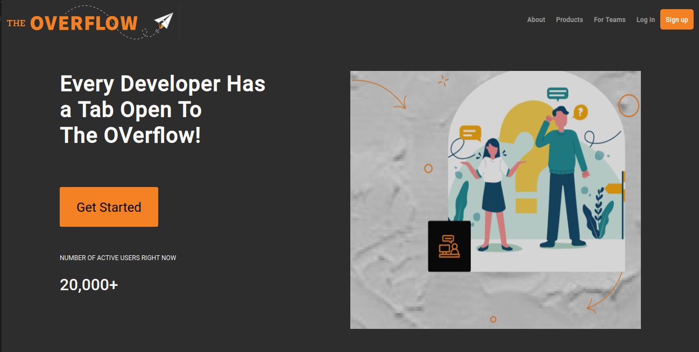
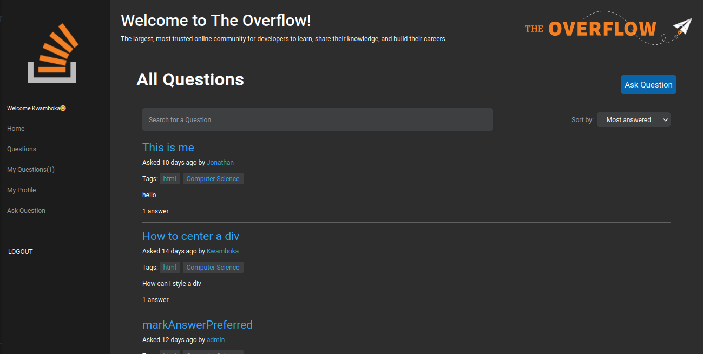
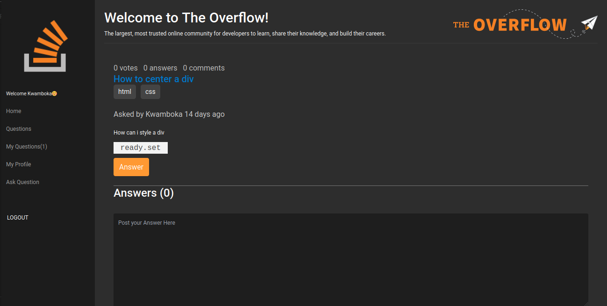
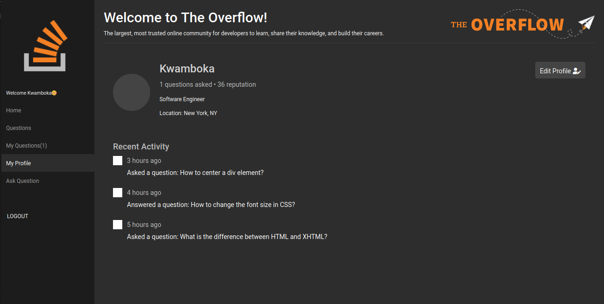
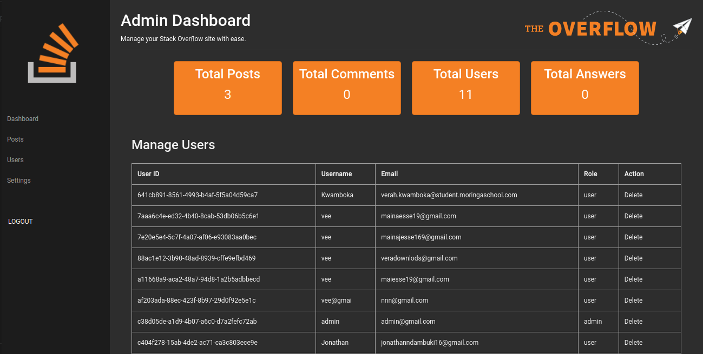

# The Overflow a Stack Overflow-lite app

The app allows users to post questions and answers on various topics. Users can upvote/downvote, comment on questions and answers.The user who posted a question can also mark an anwer as preferred. The application also has an admin dashboard for managing users, questions and answers.

## Tech Stack used
### Frontend
Responsive UI design with:
- Figma - UI design and prototyping
- Angular 15 - frontend framework
- NgRx - state management
- Angular Material - UI components

### Backend
RESTful API with:
- TypeScript - programming language
- Node.js - runtime environment
- Express.js - web framework
- Nodemailer - sending emails
- EJS - for email templates
- Node Cron - background services
- MSSQL(Stored Procedures & Queries only)
- JWT - authentication and authorization
- Bcrypt - password hashing
- Dotenv - environment variables
- Joi - dtos validation and sanitization 
- Postman - API testing and documentation

### Installation

#### Prerequisites
- Node.js
- NPM 
- Angular CLI v15
- MSSQL Server 2022

### Screenshots

